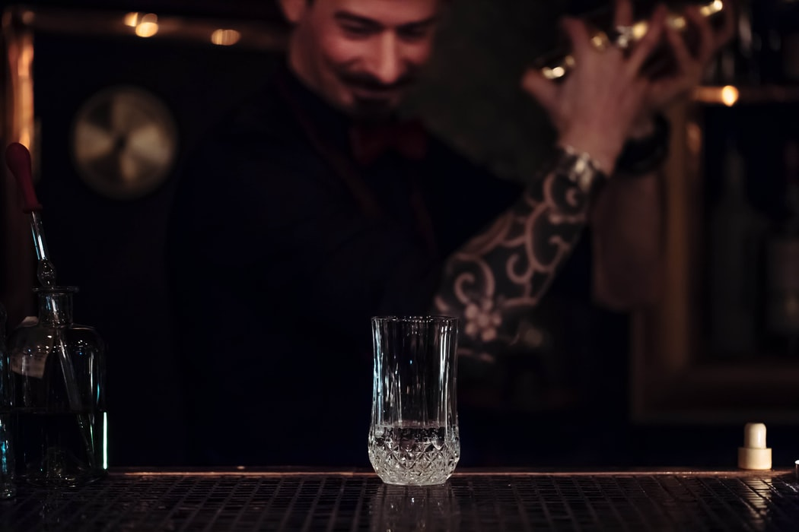

# Projeto Drinks Master

<p align="center">

</p>


Projeto do fim do módulo 4 de React do curso de desenvolvimento full stack do bootcamp Resilia.

## Proposta:
- Criar uma aplicação React que consome uma api dinamicamente.

- Utilizar Bibioteca React-router-dom para roteamento das páginas.

- Utilizar CSS grid para layout das páginas.

- Tenha uma animação CSS para carregamento inicial do site(sem
biblioteca)

- Contenha as páginas:
```js
"/" - Home
"/contact" - Contato
"/about" - Sobre nós
"/team" - Time
"/drink" - Drinks 
"/drinks/populares" - Drinks populares
"/drinks/pesquisar" - Pesquisar Drinks
```
<br>

---

## Como rodar: 

- Faça clone do repositório.

- Abra o visual code e rode comando ```yarn``` ou ```npm install```.

- E para iniciar rode o comando ```yarn start```  ou ```npm start```.

<br>

---
## Extras:

- Acesse ele online [clicando aqui](https://drinks-master.netlify.app).
- Versão mobile estável com componentes responsiveis criados sem utilização de bibliotecas.

<br>

---

## Mais...

- Api utilizada: [The Cocktail Api](https://www.thecocktaildb.com/api.php).
- Biblioteca principal: [React](https://pt-br.reactjs.org).
- Roteamento de páginas: [React Router Dom](https://reactrouter.com/web/guides/quick-start).
- Icones: [React Icons](https://react-icons.github.io/react-icons/).

